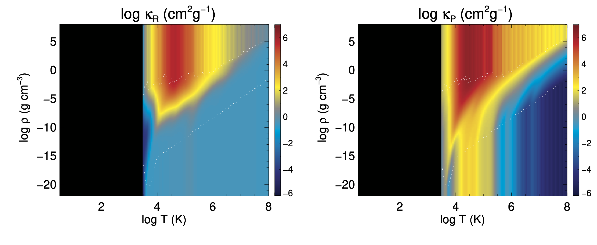

# OP opacity

---
- mixv.gs98: original opacity data
- testin/in.mixv: parameter file to create mixv.gs98
- op_ros.data: Rosseland mean opacity data (Fortran big-endian binary), generated from "mixv.gs98"
- op_pla.data: Planck mean opacity data (Fortran big-endian binary), generated from "mixv.gs98"
- read_op.F90: Fortran code to create the op_???.data
- Makefile: for compilation of read_op.F90
- opacity_table.pro: IDL code to create the above plots