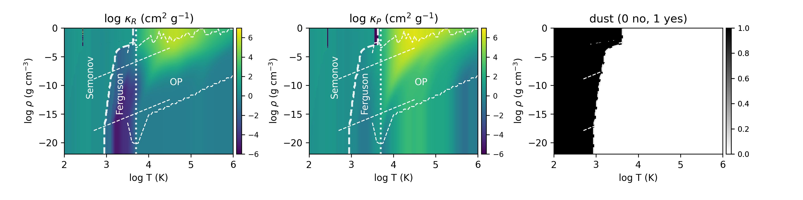

# optab14
This package contains codes to create hybrid opacity tables used in Shigenobu Hirose et al 2014 ApJ 787 1 (doi:[10.1088/0004-637X/787/1/1](http://dx.doi.org/10.1088/0004-637X/787/1/1)), based on the following public opacity tables:
- [Semenov opacity for dust](https://www2.mpia-hd.mpg.de/~semenov/Opacities/opacities.html)
- [Ferguson opacity for low-temperature gas](https://www.wichita.edu/academics/fairmount_college_of_liberal_arts_and_sciences/physics/Research/opacity.php)
- [Opacity Project for high-tempereture gas](http://cdsweb.u-strasbg.fr/topbase/TheOP.html)

## [`hybrid`](hybrid/)



Pseudo code:
```
IF EXIST(dust) THEN
    Semenov
ELSE
    IF log T > 3.7 THEN
        OP
    ELSE    
        Ferguson
    ENDIF
ENDIF
```

## [`Semenov/`](Semenov/)


## [`Ferguson/`](Ferguson/)


## [`OPCD_3.3/`](OPCD_3.3/)


---
EOF