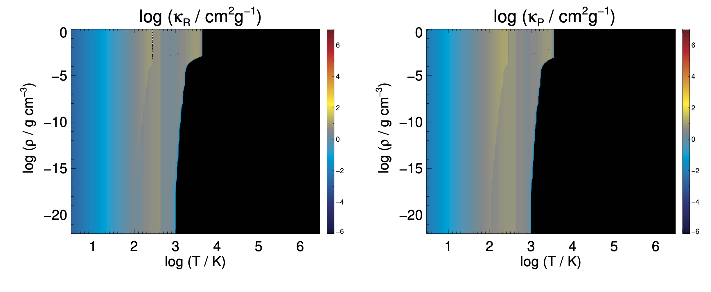

# Semenov 不透明度（Python 可視化）

このリポジトリは、Semenov らの不透明度テーブル（Planck 平均・Rosseland 平均）を Python で読み込み、可視化するための最小構成です。もともとの IDL スクリプト（`opacity.pro`）と同等の可視化を行い、透明背景の PNG と PDF を出力します。

---

## 同梱ファイルの概要

- `semenov_pla.data`: Planck 平均不透明度 κ_P のデータ（Fortran アンフォーマット・ビッグエンディアン）
- `semenov_ros.data`: Rosseland 平均不透明度 κ_R のデータ（Fortran アンフォーマット・ビッグエンディアン）
- `opacity_plot.py`: Python による可視化スクリプト（PNG/PDF を出力）
- `diagnose_opacity.py`: データの NaN や極小値の状態を数値で確認するための診断スクリプト
- `opacity.pro`: もともとの IDL 可視化コード（参考）
- `opacity.f`, `opacity.in`, `opacity.inp`: 元データ生成に関わる Fortran/入力ファイル（参考）

---

## データ形式（`semenov_*.data` の中身）

いずれも Fortran アンフォーマット（F77 形式）のビッグエンディアン・バイナリです。典型的には 4 バイトのレコードマーカーを持ち、内容は以下の2レコード構成です。

1. レコード1（int32 BE）
   - `nt`, `nd`（グリッド数）
2. レコード2（float64 BE）
   - `t[nt]`, `d[nd]`, `data[nt*nd]`

ここで
- `t` は `log10(T/K)`、`d` は `log10(ρ / g cm^-3)` の等間隔グリッド
- `data` は対応する 2 次元の不透明度値（既に `log10(κ / [cm^2 g^-1])` に変換済み）
- 配列は Fortran のカラムメジャー（列優先）で書かれているため、Python では `order='F'` で (nt, nd) に成形します。

備考
- 本リポジトリのファイルでは、`t` の範囲はおよそ 0.477〜6.477（K で約 3〜3×10^6）、`d` は -22〜0 です。
- 極小値は多くの格子点で同一のフロア値（例: `-37.92977945`）に張り付いており、物理的ゼロの代替として扱われています。

---

## 可視化（`opacity_plot.py`）

Python で `semenov_*.data` を読み込み、横軸 `T`、縦軸 `ρ`（いずれも log10 スケール）で κ_R（左）と κ_P（右）を並べて表示します。背景は透明です。

前提
- Python 3.x
- 依存: `numpy`, `matplotlib`

インストール（必要な場合）
- `pip install numpy matplotlib`

実行
- `python3 opacity_plot.py`

主なオプション
- `--ros FILE`: Rosseland 平均データ（既定: `semenov_ros.data`）
- `--pla FILE`: Planck 平均データ（既定: `semenov_pla.data`）
- `--out-prefix NAME`: 出力ファイル接頭辞（既定: `opacity` → `opacity.png`, `opacity.pdf`）
- `--vmin VAL`, `--vmax VAL`: カラースケール範囲（既定: `-6`, `7`）
- `--cmap NAME`: Matplotlib のカラーマップ名（既定: `turbo`）
- `--marker-bytes {4,8}`: Fortran レコードマーカー（既定: `4`。もし読み込みエラー時は `8` を試す）

出力
- `opacity.png`: 透明背景の PNG
- `opacity.pdf`: 透明背景の PDF

注記
- IDL の `JHCOLORS` と完全一致の配色にはなりません。必要に応じて `--cmap` を変更してください。
- 描画では NumPy 配列を転置して、X=T、Y=ρ になるよう配置しています（`imshow(data.T, extent=(tmin,tmax,dmin,dmax))`）。

---

## 診断（`diagnose_opacity.py`）

NaN の有無や極小値の分布を数値で確認します。Matplotlib は不要です。

実行
- `python3 diagnose_opacity.py`

出力例（本リポジトリのデータ）
- `t range (log10 K): 0.477 .. 6.477`
- `d range (log10 g/cc): -22.000 .. 0.000`
- `ROS: global min = -37.92977945, NaN = 0`
- `PLA: global min = -37.92977945, NaN = 0`
- 高温域（`T ≥ 1000 K`）でも NaN は 0、下限（例: `vmin=-6`）を大きく下回る極小値が大半を占めます。

---

## 極小値（黒く見える領域）の意味

- 可視化の既定範囲は `vmin=-6, vmax=7` です。これを大きく下回る値は、カラーマップの最小色（黒に近い色）で表示されます。
- 本データでは、T ≳ 1000–1500 K で塵が昇華し、塵起源の不透明度が桁落ちします。その結果、κ の対数が極端に小さい定数フロア（例: `-37.92977945`）に張り付く格子点が多数生じます。
- 診断の結果、NaN は含まれていません（黒は「欠損」ではなく「極小値」です）。

見え方を調整したい場合
- `--vmin` を小さくすると黒域にも色が付きます（ただしほぼ一色の帯になりやすい）。
- NaN と極小値を視覚的に区別したい場合は、カラーマップの「under 色」「bad 色」を設定する拡張が可能です（ご要望があれば対応します）。

---

## 参考

- `opacity.pro`: IDL 版の可視化コード（EPS 出力、`JHCOLORS` 使用）
- `opacity.f`: 元データ生成の Fortran コード（参考）
