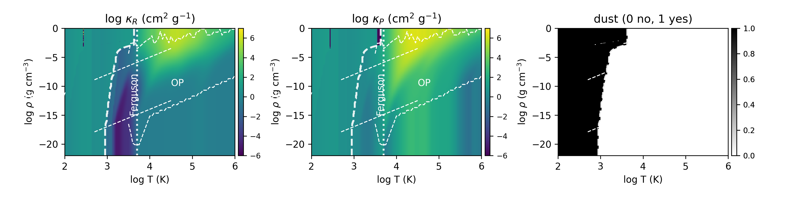

# ハイブリッド不透明度の生成と可視化手順（日本語版）

このリポジトリは、ダスト（Semenov）＋ガス（Ferguson, OP）のテーブルを温度・密度空間で合成し、Rosseland 平均（kR）と Planck 平均（kP）を出力・可視化するための資材を含みます。

主な流れは次のとおりです。
1) Fortran プログラム `hybrid.F90` を実行して不透明度テーブル（バイナリとテキスト）を生成
2) Python スクリプト `plot_opacity.py` で `kR`/`kP`/ダスト有無を可視化（PNG/PDF）

以下、使い方と入出力ファイルの詳細を説明します。

## 必要な前提
- Fortran コンパイラ（例: `gfortran`）
- Python 3（NumPy、Matplotlib）
- 上位ディレクトリに不透明度の元データが存在すること
  - `../Semenov/` に Semenov のダストテーブル（`semenov_ros.data`, `semenov_pla.data`）
  - `../Ferguson/` に Ferguson のガステーブル（`ferguson_ros.data`, `ferguson_pla.data`）
  - `../OPCD_3.3/` に OP のガステーブル（`op_ros.data`, `op_pla.data`）

ファイルパスは `hybrid.F90` 先頭の `#define` で定義されています。配置を変える場合はここを修正してください。

## 1. テーブル生成（Fortran）

ビルドと実行:

```
make      # a.out を生成
./a.out   # 出力ファイルを作成
```

制御パラメータ（実行時）:
- `use_dust.in`（任意）
  - ファイルが無い場合: 既定で「ダスト有効」
  - `0` を書く: ダスト無効
  - `1` を書く: ダスト有効

温度下限の安全チェック:
- ダスト有効（`use_dust.in` が無い、または `1`）のとき、温度下限 `tmp_min` が Semenov グリッド最小温度（`t_ser(1)`）より低いとエラーを出して停止します。
  - エラーメッセージに下限値と対処（`tmp_min` を上げるか、`use_dust.in` に `0` としてダスト無効化）を出力します。

合成ロジックの注意点（実装済み修正）:
- Planck 側の混合で Rosseland の係数を使っていたバグを修正済み（Planck は `f1p`/`f2p` を使用）。
- ダスト無効時で、ガス側の重みが両方 0 になるセルは、`kR`/`kP` に該当して `NaN` を出力します。

Fortran 実行で生成されるファイル:
- `kR.dat`（Fortran アンフォーマット: Rosseland 平均 κ, 形状 nitt×nidd, 64bit big-endian）
- `kP.dat`（Fortran アンフォーマット: Planck 平均 κ, 形状 nitt×nidd, 64bit big-endian）
- `dust.dat`（Fortran アンフォーマット: ダスト有無フラグ 0/1, 形状 nitt×nidd, 64bit big-endian）
- `opacity.in`（テキスト: 配列サイズと軸レンジのヘッダ。可視化で使用）
- `opacity_table.txt`（テキスト: 各セルの `log10T, log10ρ, kR, kP, dust` の一覧）
- `temp_fe_op.data`（テキスト: Ferguson/OP の境界温度の目印）

入力として使用するファイル（`hybrid.F90` 内で読み込み）:
- `../Semenov/semenov_ros.data`, `../Semenov/semenov_pla.data`
- `../Ferguson/ferguson_ros.data`, `../Ferguson/ferguson_pla.data`
- `../OPCD_3.3/op_ros.data`, `../OPCD_3.3/op_pla.data`
- `use_dust.in`（任意）

## 2. 可視化（Python）

可視化の実行:

```
python3 plot_opacity.py
```

入力として参照するファイル（Fortran 出力）:
- `opacity.in`（配列サイズ・軸レンジを取得）
- `kR.dat`, `kP.dat`, `dust.dat`（Fortran アンフォーマット、big-endian, 64bit）
- `temp_fe_op.data`（縦線のオーバーレイ用の温度）

オプションのオーバーレイ（存在すれば自動表示）:
- `../OPCD_3.3/border.data`（OP の有効領域）
- `../Ferguson/border.data`（Ferguson の有効領域）

出力される図:
- `opacity_table.png`, `opacity_table.pdf`
  - 左: `log κ_R`、中央: `log κ_P`、右: ダスト有無（0/1）
  - ダスト無効時にガス重みが 0 のセルは `NaN` となり、イメージでは「真っ白」に見えます（NaN は透明/白として描画）。
- `slice.pdf`（密度スライスに沿った κ の線図）

補足（データ形式）:
- `kR.dat`/`kP.dat`/`dust.dat` は Fortran のアンフォーマット（1 レコード）
  - レコードマーカー 4 バイト + 連続データ + レコードマーカー 4 バイト
  - 要素は 64bit 浮動小数（big-endian）で、配列は Fortran 並び（(nitt, nidd)）です。

## クイックスタート
```
# 1) ビルド
make

# 2) 実行（ダストを無効化したい場合は事前に 0 を書く）
echo 0 > use_dust.in   # ダスト無効（任意）
./a.out

# 3) 可視化
python3 plot_opacity.py
```

## トラブルシュート
- 実行時に温度下限エラーで止まる
  - ダスト有効時は `tmp_min >= t_ser(1)`（Semenov 最小温度）が必須です。`hybrid.F90` の温度範囲を見直すか、`use_dust.in` に `0` を書いてダストを無効化してください。
- 可視化が真っ白に見える領域がある
  - ダスト無効時でガス重みゼロのセルは `NaN` を出力します。NaN は透明（白）として描画されます。

## ファイル一覧（概要）
- `hybrid.F90`: 不透明度テーブルを生成する Fortran コード
- `Makefile`: `hybrid.F90` のビルド設定（`-fconvert=big-endian` で出力互換を確保）
- `plot_opacity.py`: Python による可視化スクリプト（PNG/PDF/スライス）
- `opacity_table.pro`: 既存の IDL スクリプト（参考）
- `kR.dat`, `kP.dat`, `dust.dat`, `opacity.in`, `opacity_table.txt`, `temp_fe_op.data`: Fortran 実行後の生成物

---

